# Análise do Impacto de Condições Adversas de Rede na QoE de Streaming HLS

**Disciplina:** Análise de Desempenho de Redes de Computadores
**Professor:** Arthut Callado   
**Aluno:** Halyson Lima   
**Instituição:** Universidade Federal do Ceará  
**Data:** Maio - Junho de 2026


## Resumo

Este estudo experimental quantifica o impacto de diferentes níveis de **perda de pacotes** (0%, 1%, 5%, 15%) e **latência adicional** (0ms, 50ms, 200ms, 500ms) sobre a Qualidade de Experiência (QoE) de um serviço de streaming adaptativo baseado no protocolo HLS (HTTP Live Streaming). Utilizando emulação de rede controlada com **Mininet** e **tc netem**, um servidor **nginx** com HLS real, e um cliente Python com algoritmo **ABR** (Adaptive Bitrate) implementado do zero, foram realizadas **480 execuções** (16 cenários × 30 repetições).

Os resultados demonstram que a **latência é o fator dominante** na degradação da QoE, com redução de 63% no goodput ao adicionar 50ms de delay, contra apenas 18% ao adicionar 15% de perda. O **ponto de ruptura** foi identificado em 500ms de latência, onde o goodput colapsa para abaixo do bitrate mínimo (1.200 Kbps), causando stalls em todas as repetições. A **interação entre fatores** só se mostra significativa na faixa de 200ms, e o **ABR apresenta comportamento binário** (máximo ou mínimo) em função da latência. Por fim, **HTTP 200 OK = 100%** em todos os experimentos, evidenciando que disponibilidade do serviço não implica boa QoE.


## Sobre o Trabalho

Estudo experimental que quantifica o impacto de diferentes níveis de **perda de pacotes** e **latência adicional** sobre a Qualidade de Experiência (QoE) de um serviço de streaming adaptativo baseado no protocolo HLS (HTTP Live Streaming).

O experimento utiliza emulação de rede controlada com **Mininet** e **tc netem**, um servidor **nginx** com HLS real, e um cliente Python com algoritmo **ABR** (Adaptive Bitrate) implementado do zero.

### Tema e Relevância

Streaming representa mais da metade do tráfego global de internet. A QoE pode colapsar mesmo com o serviço HTTP 100% disponível. Compreender os limiares de degradação é essencial para dimensionar infraestruturas de streaming. O HLS opera sobre HTTP/TCP e as condições adversas afetam diretamente o throughput TCP e, por consequência, o comportamento do ABR.


## Objetivos

| Nível | Objetivo |
|-------|----------|
| **Primário** | Quantificar o impacto de diferentes níveis de perda de pacotes e latência sobre as métricas de QoE de streaming HLS com ABR |
| **Secundário** | Comparar o efeito isolado de cada fator (só perda / só latência) versus o efeito combinado dos dois fatores simultaneamente |
| **Terciário** | Identificar os limiares de perda e latência a partir dos quais a QoE se torna severamente degradada (stalls > 0, bitrate < 1.000 Kbps) |


## Métricas

### Primárias de QoE (o que o usuário percebe)

| Métrica | Unidade | Limiar de ruptura | Justificativa |
|---------|---------|-------------------|---------------|
| Stall events | eventos/rep | > 0 | Pausa na reprodução |
| Bitrate ABR médio | Kbps | < 1.000 Kbps | Qualidade visual selecionada pelo algoritmo |
| Quality switches | número/coleta | > 3 | Instabilidade do ABR |

### De transporte (por que a QoE degradou)

| Métrica | Unidade | Função |
|---------|---------|--------|
| HTTP Goodput | Kbps | Capacidade efetiva do enlace para o vídeo |
| Latência TCP (time_connect) | ms | Custo do handshake TCP |

### De validação (tc netem foi aplicado corretamente?)

- RTT medido · Jitter medido · Perda medida · HTTP OK percentual


## Fatores e Níveis — Fatorial Completo 4×4

| Fator | Níveis | Representatividade |
|-------|--------|---------------------|
| Perda de pacotes | 0% · 1% · 5% · 15% | Rede ideal → altamente degradada |
| Latência adicional | 0 ms · 50 ms · 200 ms · 500 ms | Local → Nacional → Transcontinental → Satélite |

**16 cenários únicos × 30 repetições = 480 execuções**

Identificação dos cenários: `p{perda}_d{delay}` — ex: `p5_d200` = 5% de perda, 200 ms de delay.


## Configuração do Experimento

| Parâmetro | Valor |
|-----------|-------|
| Enlace | 100 Mbps |
| Latência base | 2 ms |
| Vídeo | Mandelbrot sintético (GOP fixo, 1080p) |
| Bitrates disponíveis | 1.200 (LOW) / 4.000 (MID) / 8.000 (HIGH) Kbps |
| Duração da coleta | 60 s por repetição |
| Warm-up adaptativo | 10–30 s por cenário |
| Cool-down | 30 s |
| Repetições | 30 por cenário |
| Hardware | Linux Ubuntu 24.04 · i5-8400 · 16 GB RAM |

---

## Técnica de Experimentação

### Abordagem: Emulação Controlada

- **Mininet** para criação da topologia de rede
- **tc netem** para injeção de perda, delay e jitter
- **nginx** real como servidor HLS
- **Cliente Python** com ABR implementado do zero

### Por que emulação?

| Abordagem | Vantagem | Desvantagem |
|-----------|----------|-------------|
| Simulação (ns-3, OMNeT++) | Rápida, escalável | Abstração da pilha TCP |
| **Emulação (Mininet + tc netem)** | Código real, pilha TCP real | Mais lenta |
| Experimento em campo | Realista | Sem controle das condições |

Nossa escolha: **Emulação** → controle total + reprodutibilidade + pilha TCP real.

### Análise Estatística

- **Intervalo de confiança:** 95%
- **Distribuição:** t de Student
- **n = 30** repetições por cenário
- **Graus de liberdade:** n-1 = 29
- **t(29; 0,025) = 2,045**
- **Fórmula:** `IC = x̄ ± t × s/√n`


## Execução dos Experimentos

### Arquitetura

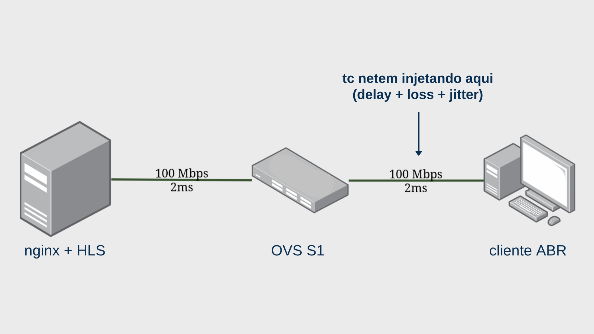

### Coleta por Repetição (60 segundos)

1. **Ping** (RTT, jitter, perda medida) - a cada 2.5s
2. **Download de segmento HLS** via curl
3. **Medição de time_connect** (TCP handshake)
4. **Medição de speed_download** (throughput)
5. **Decisão ABR** para o próximo segmento
6. **Detecção de stall** (time_total > 3s)

### Algoritmo ABR Implementado

```
UPGRADE_FACTOR = 1.3   # sobe se throughput > bitrate_atual * 1.3
DOWNGRADE_FACTOR = 0.8 # desce se throughput < bitrate_atual * 0.8

if avg_throughput > current_bitrate * UPGRADE_FACTOR:
    upgrade_quality()
elif avg_throughput < current_bitrate * DOWNGRADE_FACTOR:
    downgrade_quality()
```

### Tempo Total de Execução

| Componente | Tempo |
|------------|-------|
| Coleta efetiva | 60s |
| Warm-up adaptativo | 10-30s |
| Cool-down | 30s |
| **Total por repetição** | ~100-120s |
| **Total geral (16×30)** | **aproximadamente 15 horas** |

O script `experimento_final.py` implementa **retomada automática**, se interrompido, continua do último cenário salvo, pulando os que ja constarem no csv final.


## Scripts do Projeto

| Script | Função |
|--------|--------|
| `configurar.py` | Gera vídeo sintético Mandelbrot e segmentos HLS (3 qualidades) |
| `experimento_final.py` | Executa o fatorial completo 4×4 (480 execuções) |
| `analise_final.py` | Processa dados, calcula IC 95% e gera 15 gráficos |
| `validar.py` | Verifica ambiente: ping, nginx, tc netem |
| `poc_qoe.py` | Prova de conceito (6 cenários, 5 repetições) |


## Resultados - Heatmaps

### Gráfico 1: Heatmap de Goodput (Kbps)

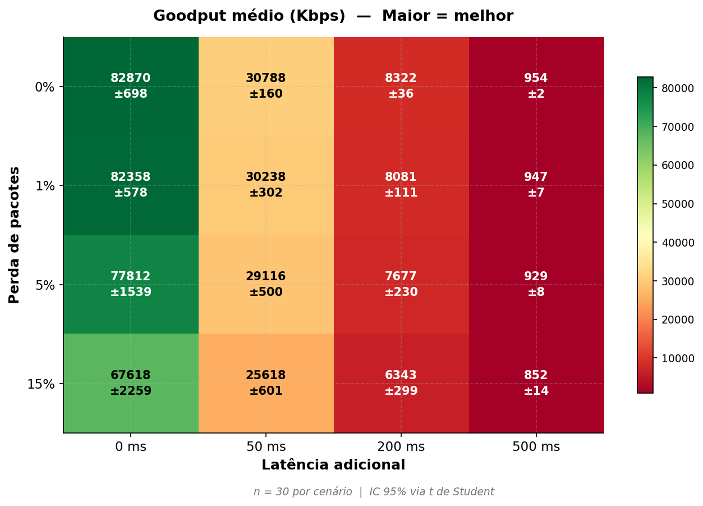

**Análise:** O goodput é fortemente afetado pela latência. Com delay de 0ms, mantém-se próximo a 80.000 Kbps mesmo com perda de 15%. Com 50ms de delay, cai para ~30.000 Kbps. Em 500ms, colapsa para menos de 1.000 Kbps.


### Gráfico 2: Heatmap de Stall Events (eventos/60s)

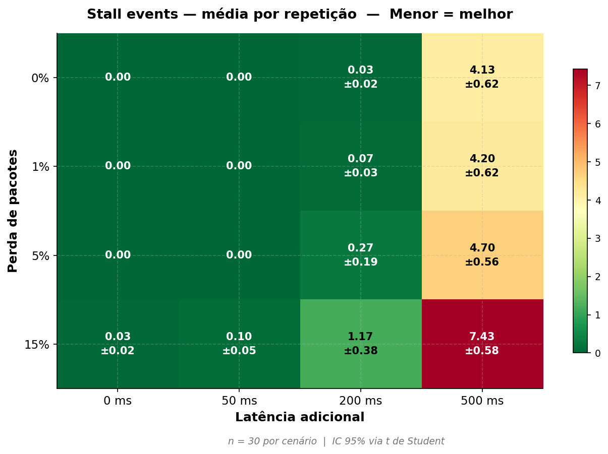

**Análise:** Sem stalls para delays ≤ 50ms. Em 200ms, stalls começam a aparecer com perda alta (1,17 stalls). Em 500ms, sistema colapsa: 4,13 a 7,43 stalls por minuto.


### Gráfico 3: Heatmap de Bitrate ABR (Kbps)

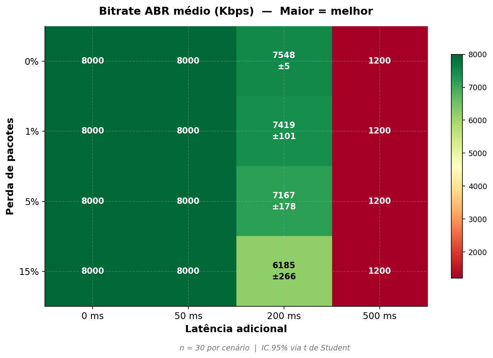

**Análise:** Comportamento binário do ABR. Delay ≤ 50ms: sempre 8.000 Kbps. Delay = 200ms: adaptação entre 6.185-7.548 Kbps. Delay = 500ms: sempre 1.200 Kbps (piso).


### Gráfico 4: Heatmap de TCP Connection Time (ms)

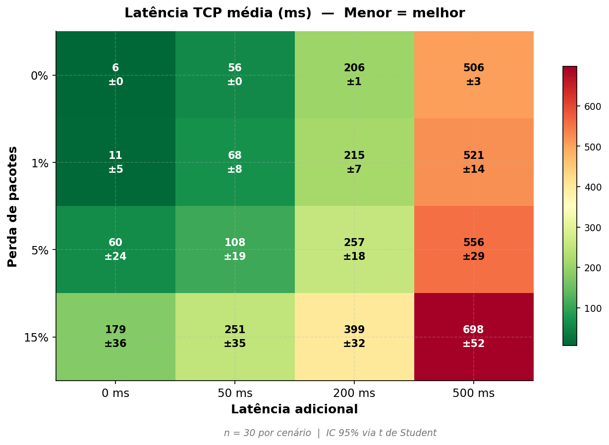

**Análise:** Sem perda, tcp_conn ≈ delay + 6ms. Com perda, tempo aumenta drasticamente por retransmissões. Em p15_d500, atinge 697,68ms.


## Gráficos de Barras

### Gráfico 5: HTTP Goodput por Cenário

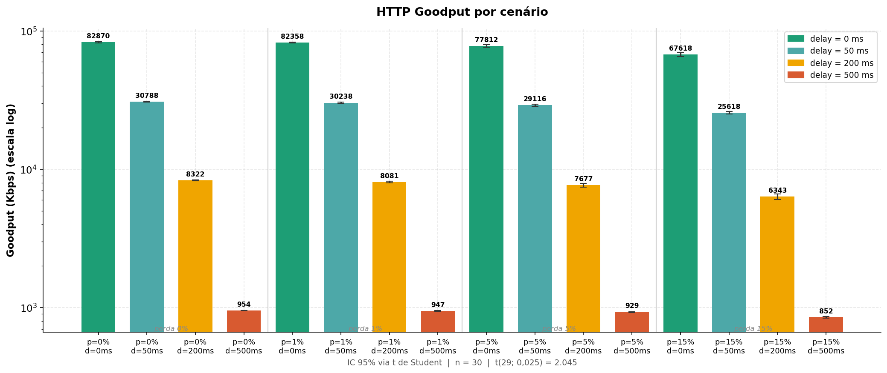

**Análise:** Queda abrupta em 50ms e novamente em 500ms. Em 500ms, goodput (~950 Kbps) é inferior ao bitrate mínimo (1.200 Kbps).


### Gráfico 6: Stall Events por Cenário

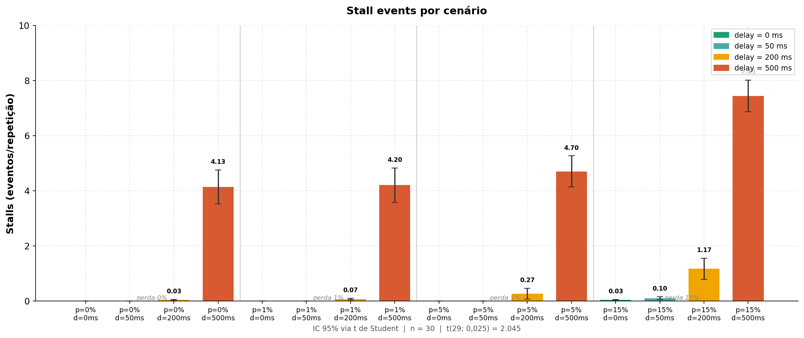

**Análise:** Zero stalls para delay ≤ 50ms. Ruptura clara em 500ms com todos cenários apresentando stalls.


### Gráfico 7: Bitrate ABR por Cenário

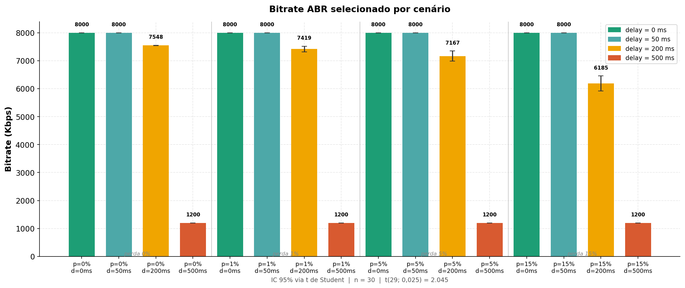

**Análise:** Comportamento binário evidente: máximo, adaptação ou piso.


### Gráfico 8: TCP Connection Time por Cenário

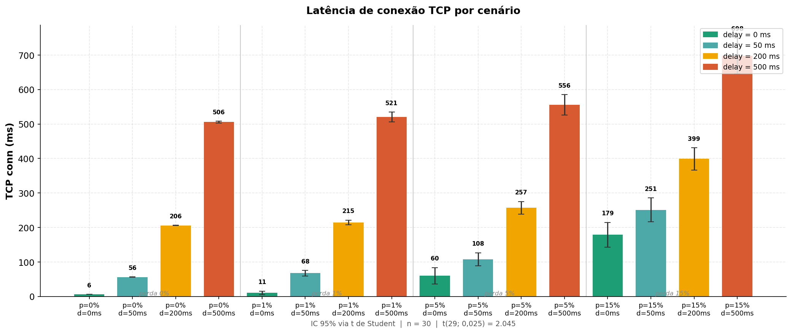

**Análise:** Aumento significativo do handshake TCP com perda alta.


## Gráficos de Interação e Validação

### Gráfico 9: Interação Latência × Perda

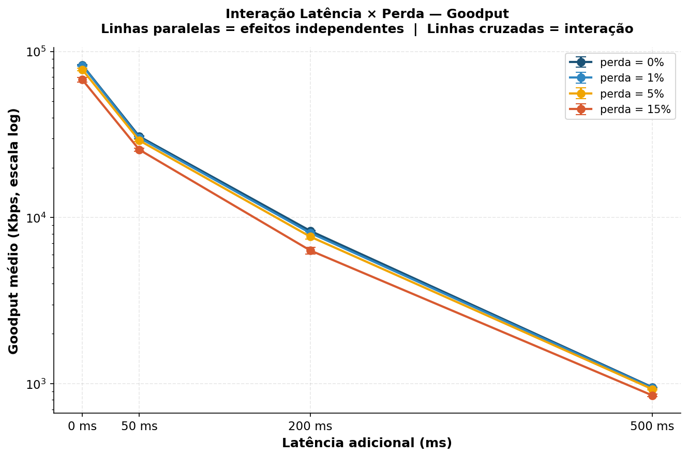

**Análise:** Curvas paralelas → efeitos maiormente aditivos. Não há interação forte para goodput.


### Gráfico 10: Goodput vs Bitrate ABR

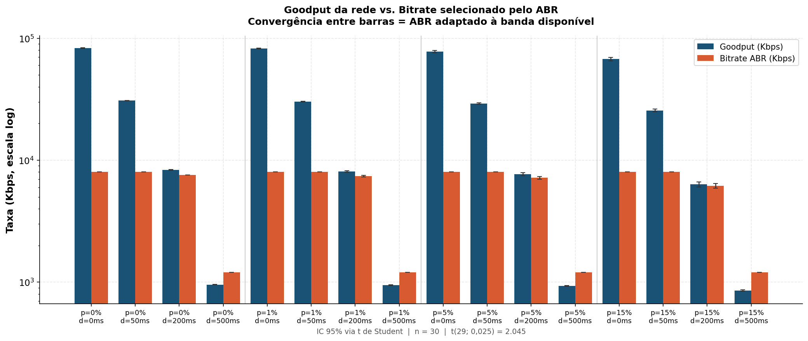

**Análise:** Em 500ms, goodput < bitrate mínimo, explicando falha do ABR.


### Gráfico 11: Validação RTT

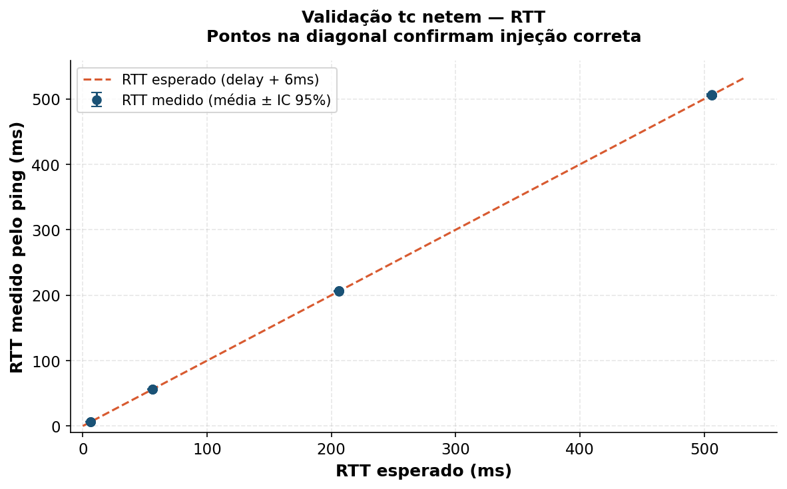

**Análise:** Pontos na diagonal → tc netem injetou delays corretamente.


### Gráfico 12: Validação Perda

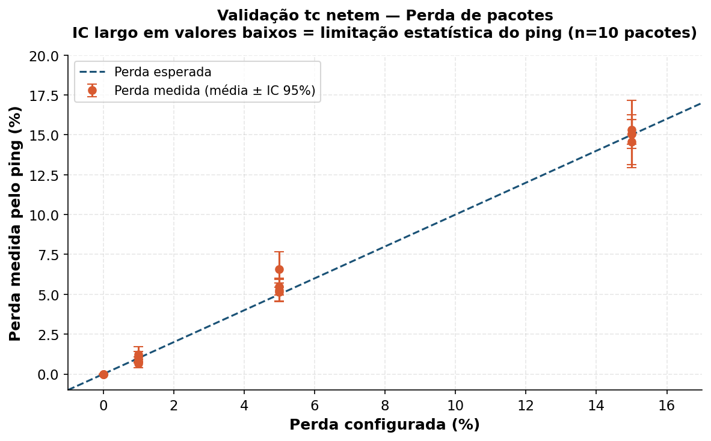

**Análise:** Médias alinhadas com valores configurados. IC largo para perdas baixas por limitação do ping.


## Boxplots

### Gráfico 13: Distribuição do Goodput

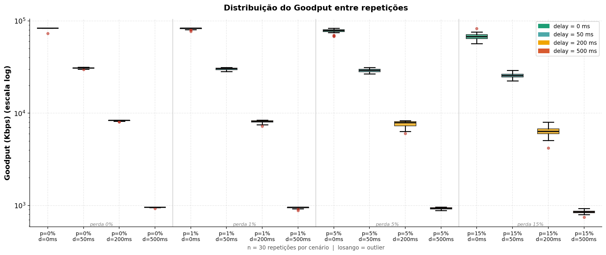

**Análise:** Distribuições compactas para delays baixos, mais largas em 200ms, muito estreitas em 500ms.


### Gráfico 14: Distribuição dos Stalls

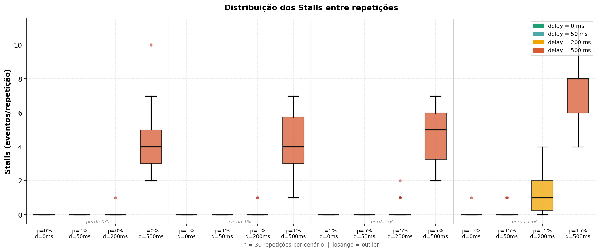

**Análise:** Em 500ms, distribuição ampla com valores de 2 a 11 stalls.


### Gráfico 15: Amostras por Repetição

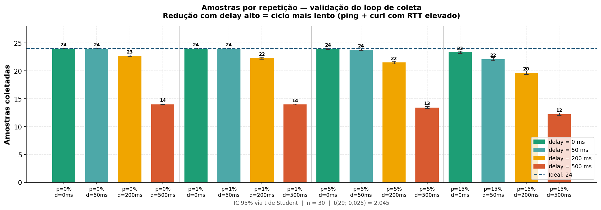

**Análise:** Ideal 24 amostras. Delay 500ms reduz para 12-14 amostras (420 observações/cenário → suficiente).


## Dados Completos (CSVs)

Os dados brutos e processados estão disponíveis nos seguintes arquivos:

| Arquivo | Conteúdo |
|---------|----------|
| `resultados/experimento_final_resultados.csv` | Dados brutos (480 linhas, 25 colunas) |
| `resultados/resultados_processados.csv` | Médias, IC95%, std, min, max por cenário |
| `resultados/estatisticas_resumo.csv` | Resumo compacto das métricas principais |
| `resultados/heatmaps.csv` | Dados formatados para geração de heatmaps |
| `resultados/matriz_http_goodput_kbps.csv` | Matriz Goodput (4×4 com IC95%) |
| `resultados/matriz_stall_events.csv` | Matriz Stalls (4×4 com IC95%) |
| `resultados/matriz_avg_bitrate_selected_kbps.csv` | Matriz Bitrate ABR (4×4 com IC95%) |
| `resultados/matriz_tcp_conn_ms.csv` | Matriz TCP conn (4×4 com IC95%) |
| `resultados/matriz_rtt_ms.csv` | Matriz RTT (4×4 com IC95%) |
| `resultados/matriz_perda_medida.csv` | Matriz perda medida (4×4 com IC95%) |

Para visualizar os dados completos, utilize:

```bash
head -10 resultados/estatisticas_resumo.csv

python3 -c "import pandas as pd; print(pd.read_csv('resultados/estatisticas_resumo.csv'))"
```


## Descobertas Principais

### Descoberta 1: Latência é o fator dominante

| Cenário | Goodput | Queda |
|---------|---------|-------|
| Baseline (p0_d0) | 82.870 Kbps | — |
| Apenas 50ms delay (p0_d50) | 30.788 Kbps | -63% |
| Apenas 15% perda (p15_d0) | 67.618 Kbps | -18% |

**Explicação (Fórmula de Mathis):**
``` math
Throughput ∝ 1 / (RTT × √p)
```
- RTT afeta linearmente → dobra RTT, corta throughput pela metade
- Perda é atenuada pela raiz quadrada

### Descoberta 2: Ponto de ruptura em 500 ms

| Cenário | Goodput | Bitrate | Stalls |
|---------|---------|---------|--------|
| p0_d500 | ~954 Kbps | 1.200 (piso) | 4,13/rep |
| p15_d500 | ~852 Kbps | 1.200 (piso) | 7,43/rep |

**Por que 500ms é o limiar?** Goodput colapsa para abaixo do bitrate mínimo (1.200 Kbps). ABR não sustenta nem a qualidade mais baixa.

### Descoberta 3: Interação na faixa de 200 ms

| Delay | perda 0% | perda 15% | diferença |
|-------|----------|-----------|-----------|
| 50ms | 0,00 stalls | 0,10 stalls | pequena |
| 200ms | 0,03 stalls | 1,17 stalls | GRANDE |
| 500ms | 4,13 stalls | 7,43 stalls | mantida |

A faixa de 200ms é a única onde combinar perda e latência produz degradação significativamente maior que a soma dos efeitos isolados.

### Descoberta 4: ABR tem comportamento binário

| Delay | Bitrate | Comportamento |
|-------|---------|---------------|
| ≤ 50ms | 8.000 Kbps | MAXIMO |
| = 200ms | 6.185–7.548 Kbps | ADAPTACAO PARCIAL |
| = 500ms | 1.200 Kbps | PISO |

### Descoberta 5: HTTP disponível ≠ boa QoE

**HTTP 200 OK = 100% em todos os 480 experimentos**

Mesmo quando:
- Stalls = 7,43/rep (p15_d500)
- Bitrate = 1.200 Kbps (piso)
- Quality switches = 0


## Validação do Experimento

Os dados de validação confirmam que o tc netem funcionou corretamente:

| Validação | Resultado |
|-----------|-----------|
| RTT medido vs esperado | Pontos na diagonal (offset de 6ms) |
| Perda medida vs configurada | Médias alinhadas |
| HTTP OK % | 100% em 480 execuções |

Consulte `resultados/matriz_rtt_ms.csv` e `resultados/matriz_perda_medida.csv` para os valores completos.


## Conclusões

| Item | Descoberta | Implicação Prática |
|------|------------|-------------------|
| 1 | Latência causa queda de goodput 3x maior que perda isolada | Projetar CDNs com RTT baixo |
| 2 | Ruptura em 500ms → goodput < bitrate mínimo | Satélite geoestacionário inviável para HLS |
| 3 | ABR tem comportamento binário | Algoritmo pode ser melhorado com buffer occupancy |
| 4 | HTTP 100% disponível ≠ boa QoE | Monitorar QoE diretamente (stalls, bitrate) |
| 5 | Interação só é relevante em 200ms | Faixa crítica onde perda e latência se combinam |

### Resposta aos Objetivos

| Objetivo | Resposta |
|----------|----------|
| Primário | Latência de 50ms reduz goodput em 63%; perda de 15% reduz em apenas 18% |
| Secundário | Efeitos são maiormente aditivos; única exceção na faixa de 200ms |
| Terciário | Stalls > 0 a partir de 200ms com perda alta; bitrate < 1.000 Kbps a partir de 500ms |


## Limitações e Trabalhos Futuros

| Limitação | Impacto | Mitigação / Trabalho Futuro |
|-----------|---------|------------------------------|
| tc netem injeta condições estáticas | Não modela burst de perda nem jitter dinâmico | Usar emulação com modelos realísticos (Gilbert-Elliott) |
| ABR baseado apenas em throughput | Players reais usam buffer occupancy | Implementar BOLA ou ABR com buffer |
| Vídeo sintético (Mandelbrot) | GOP fixo difere de conteúdo real | Usar vídeos reais (Big Buck Bunny, Tears of Steel) |
| Detecção de stall por threshold (3s) | Sem modelo explícito de buffer | Simular buffer do player |
| delay_severo: ~14 amostras/rep | Ciclo mais lento por RTT elevado | 14 amostras × 30 reps = 420 observações — suficiente |


## Como Executar

### Dependências

```bash
sudo apt install mininet
pip install matplotlib scipy numpy pandas

# nginx com HLS configurado
# Execute configurar.py para gerar os segmentos de vídeo e nginx-hls.onf
```

### Rodar o Experimento

```bash
# Experimento final (16 cenários × 30 reps ≈ 15 horas)
sudo python3 scripts/experimento_final.py

# O script retoma automaticamente se interrompido.
# Progresso salvo em experimento_final_resultados.csv
```

### Gerar Análise e Gráficos

```bash
python3 scripts/analise_final.py
```

Gera 15 gráficos no diretório configurado e imprime os resultados numéricos no terminal.


## Estrutura do Repositório

```
experimento/
├── graficos/
│   └── final/
│       ├── g1_heatmap_goodput.png
│       ├── g2_heatmap_stalls.png
│       ├── g3_heatmap_bitrate.png
│       ├── g4_heatmap_tcp.png
│       ├── g5_barras_goodput.png
│       ├── g6_barras_stalls.png
│       ├── g7_barras_bitrate.png
│       ├── g8_barras_tcp.png
│       ├── g9_interacao_goodput.png
│       ├── g10_goodput_vs_bitrate.png
│       ├── g11_validacao_rtt.png
│       ├── g12_validacao_perda.png
│       ├── g13_boxplot_goodput.png
│       ├── g14_boxplot_stalls.png
│       └── g15_n_amostras.png
├── resultados/
│   ├── experimento_final_resultados.csv
│   ├── resultados_processados.csv
│   ├── heatmaps.csv
│   ├── estatisticas_resumo.csv
│   └── matriz_*.csv
├── scripts/
│   ├── configurar.py
│   ├── experimento_final.py
│   ├── analise_final.py
│   ├── validar.py
│   ├── poc_qoe.py
│   ├── analise_poc.py
│   └── requirements.txt
├── hls/
│   └── video/
│       ├── master.m3u8
│       ├── low.m3u8 / low*.ts
│       ├── mid.m3u8 / mid*.ts
│       └── high.m3u8 / high*.ts
├── nginx-hls.conf
└── README.md
```


## Referências

- HEMMINGER, S. Network Emulation with NetEm. Open Source Development Lab (OSDL), 2005. Disponível em: https://man7.org/linux/man-pages/man8/tc-netem.8.html. Acesso em: 11 jun. 2026.
- HOSSFELD, T. et al. Quality of Experience of YouTube Video Streaming. ACM SIGCOMM Computer Communication Review, v. 42, n. 1, p. 110-115, 2012.
- ITU-T. Recommendation P.10/G.100: Vocabulary for performance, quality of service and quality of experience. International Telecommunication Union, 2017.
- MATHIS, M. et al. The Macroscopic Behavior of the TCP Congestion Avoidance Algorithm. ACM SIGCOMM Computer Communication Review, v. 27, n. 3, p. 67-82, 1997.
- MININET TEAM. Mininet: An Instant Virtual Network on your Laptop. Disponível em: https://mininet.org/. Acesso em: 11 jun. 2026.
- PANTOS, R.; MAY, W. HTTP Live Streaming. RFC 8216, RFC Editor, 2017.
